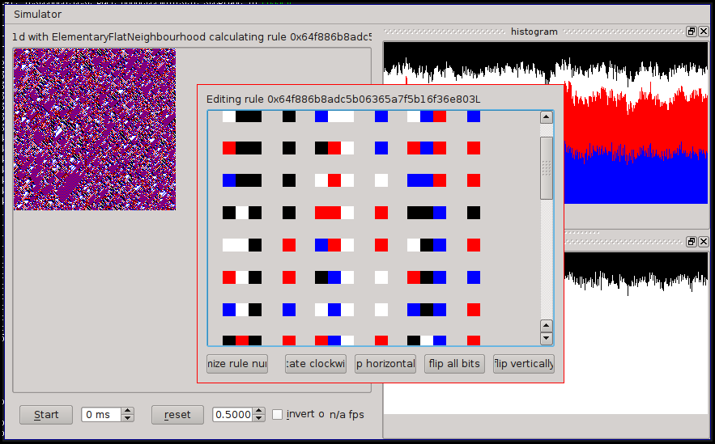
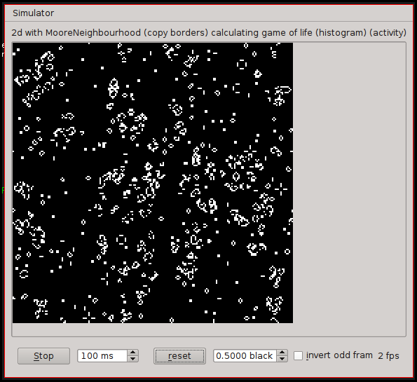
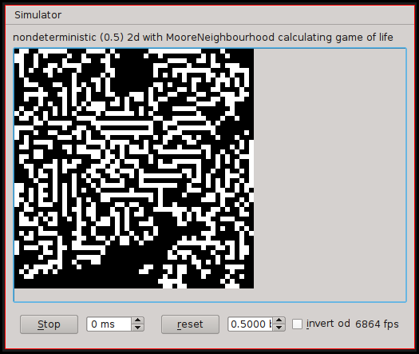
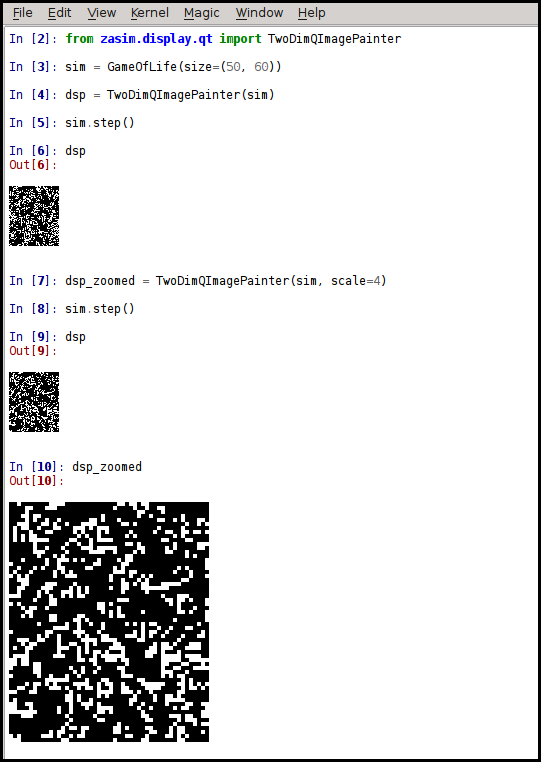
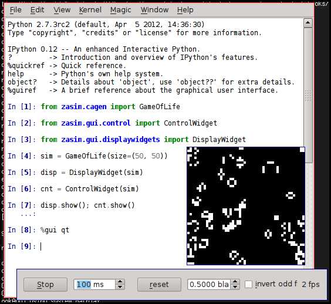
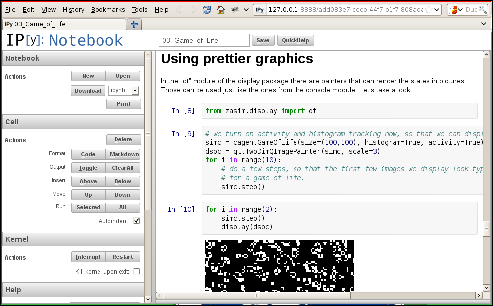

.. _screenshot_gallery:

Screenshot gallery
==================

    Running a four-color one-dimensional CA with a histogram, activity chart and the basic rule editor open.

    Running Conway's Game of Life.

    Running Game of Life with a nondeterministic step function gives mazes/noodles.

    Using the ipython qtconsole, you can display configurations inline.

    IPythons magic `%gui qt` command will run an event loop allowing us to use qt widgets like the ones zasim offers at the same time as running code.

    Zasim comes with a IPython notebook based interactive tutorial.

